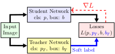
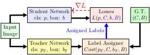
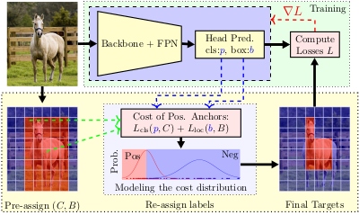
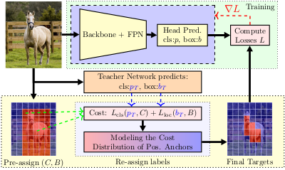
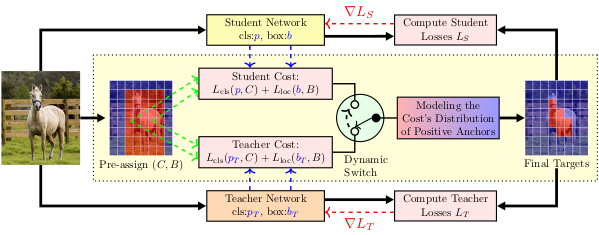

# Improving Object Detection by Label Assignment Distillation

This is the official implementation of the WACV 2022 paper [Improving Object Detection by Label Assignment Distillation](https://arxiv.org/abs/2108.10520). We provide the code for Label Assignement Distillation (LAD), training logs and several model checkpoints.

## What's New
- [May 18, 2022] release code for [SoLAD](configs/lad/paa_solad_r50_r101p1x_1x_coco.py) and [KDLoss](configs/kd/kd_r50_r101p1x_kl_i05_g05_1x_coco.py)

## Table of Contents
1. [Introduction](#introduction)
2. [Installation](#installation)
3. [Usage](#usage)
4. [Experiments](#experiments)
5. [Citation](#citation)


--------------------------------------------------------------------------------
## Introduction
This is the official repository for the paper `Improving Object Detection by Label Assignment Distillation`.
   
| Soft Label Distillation concept (a) | Label Assignment Distillation concept (b) |
| :---------------------------------: | :---------------------------------------: |
|               |                     |

+ Distillation in Object Detection is typically achived by mimicking the teacher's output directly, such soft-label distillation or feature mimicking (Fig 1.a). 
+ We propose the concept of Label Assignment Distillation (LAD), which solves the label assignment problems from distillation perspective, thus allowing the student learns from the teacher's knowledge without direct mimicking (Fig 1.b). LAD is very general, and applied to many dynamic label assignment methods. Following figure shows a concrete example of how to adopt Probabilistic Anchor Assignment (PAA) to LAD.

| Probabilistic Anchor Assignment (PAA) | Label Assignment Distillation (LAD) based on PAA |
| :-----------------------------------: | :----------------------------------------------: |
|                  |                             |

+ We demonstrate a number of advantages of LAD, notably that it is very simple and effective, flexible to use with most of detectors, and complementary to
other distillation techniques. 
+ Later, we introduced the Co-learning dynamic Label Assignment Distillation (CoLAD) to allow two networks to be trained mutually based on a dynamic switching criterion. We show that two networks trained with CoLAD are significantly better than if each was trained individually, given the same initialization. 



--------------------------------------------------------------------------------
## Installation

- Create environment:
```bash
conda create -n lad python=3.7 -y
conda activate lad
```

- Install dependencies:
```bash
conda install pytorch=1.7.0 torchvision cudatoolkit=10.2 -c pytorch -y
pip install openmim future tensorboard sklearn timm==0.3.4
mim install mmcv-full==1.2.5
mim install mmdet==2.10.0
pip install -e ./
```


--------------------------------------------------------------------------------
## Usage
#### Train the model
```bash
#!/usr/bin/env bash
set -e
export GPUS=2
export CUDA_VISIBLE_DEVICES=0,2

CFG="configs/lad/paa_lad_r50_r101p1x_1x_coco.py"
WORKDIR="/checkpoints/lad/paa_lad_r50_r101p1x_1x_coco"

mim train mmdet $CFG --work-dir $WORKDIR \
    --gpus=$GPUS --launcher pytorch --seed 0 --deterministic
```

#### Test the model
```bash
#!/usr/bin/env bash
set -e
export GPUS=2
export CUDA_VISIBLE_DEVICES=0,2

CFG="configs/paa/paa_lad_r50_r101p1x_1x_coco.py"
CKPT="/checkpoints/lad/paa_lad_r50_r101p1x_1x_coco/epoch_12.pth"

mim test mmdet $CFG --checkpoint $CKPT --gpus $GPUS --launcher pytorch --eval bbox
```


--------------------------------------------------------------------------------
## Experiments

### 1. A Pilot Study - Preliminary Comparison.

Table 2: Compare the performance of the student PAA-R50 using Soft-Label, Label Assignment Distillation (LAD) and their combination (SoLAD) on COCO validation set.

|       Method       | Teacher  |      Student       | gamma |  mAP  | Improve |                                               Config                                               |                                                                                                                                     Download                                                                                                                                      |
| :----------------: | :------: | :----------------: | :---: | :---: | :-----: | :------------------------------------------------------------------------------------------------: | :-------------------------------------------------------------------------------------------------------------------------------------------------------------------------------------------------------------------------------------------------------------------------------: |
|      Baseline      |   None   | PAA-R50 (baseline) |   2   | 40.4  |    -    | [config](https://github.com/open-mmlab/mmdetection/tree/master/configs/paa/paa_r50_fpn_1x_coco.py) |            [model](https://download.openmmlab.com/mmdetection/v2.0/paa/paa_r50_fpn_1x_coco/paa_r50_fpn_1x_coco_20200821-936edec3.pth) \| [log](https://download.openmmlab.com/mmdetection/v2.0/paa/paa_r50_fpn_1x_coco/paa_r50_fpn_1x_coco_20200821-936edec3.log.json)            |
| Soft-Label-KL loss | PAA-R101 |      PAA-R50       |  0.5  | 41.3  |  +0.9   |                     [config](configs/kd/kd_r50_r101p1x_kl_i05_g05_1x_coco.py)                      | [model](http://118.69.233.170:60001/open/LAD_WACV22/kd_r50_r101p1x_kl_i05_g05_1x_coco/kd_r50_r101p1x_kl_i05_g05_1x_coco-996efb61.pth) \| [log](http://118.69.233.170:60001/open/LAD_WACV22/kd_r50_r101p1x_kl_i05_g05_1x_coco/kd_r50_r101p1x_kl_i05_g05_1x_coco-996efb61.log.json) |
|     LAD (ours)     | PAA-R101 |      PAA-R50       |   2   | 41.6  |  +1.2   |                        [config](configs/lad/paa_lad_r50_r101p1x_1x_coco.py)                        |             [model](http://118.69.233.170:60001/open/LAD_WACV22/paa_lad_r50_r101p1x_1x_coco/paa_lad_r50_r101p1x_1x_coco-a6e0b93b.pth) \| [log](http://118.69.233.170:60001/open/LAD_WACV22/paa_lad_r50_r101p1x_1x_coco/paa_lad_r50_r101p1x_1x_coco-a6e0b93b.log.json)             |
|    SoLAD(ours)     | PAA-R101 |      PAA-R50       |  0.5  | 42.4  |  +2.0   |                       [config](configs/lad/paa_solad_r50_r101p1x_1x_coco.py)                       |         [model](http://118.69.233.170:60001/open/LAD_WACV22/paa_solad_r50_r101p1x_1x_coco/paa_solad_r50_r101p1x_1x_coco-fd940fa4.pth) \| [log](http://118.69.233.170:60001/open/LAD_WACV22/paa_solad_r50_r101p1x_1x_coco/paa_solad_r50_r101p1x_1x_coco-fd940fa4.log.json)         |


### 2. A Pilot Study - Does LAD need a bigger teacher network?
Table 3: Compare Soft-Label and Label Assignment Distillation (LAD) on COCO validation set. Teacher and student use ResNet50 and ResNet101 backbone, respectively. 2× denotes the 2× training schedule.

| Method        | Teacher | Student  | mAP  | Improve | Config                                                                                              | Download                                                                                                                                                                                                                                                                          |
| ------------- | ------- | -------- | ---- | ------- | --------------------------------------------------------------------------------------------------- | --------------------------------------------------------------------------------------------------------------------------------------------------------------------------------------------------------------------------------------------------------------------------------- |
| Baseline      | None    | PAA-R50  | 40.4 | -       | [config](https://github.com/open-mmlab/mmdetection/tree/master/configs/paa/paa_r50_fpn_1x_coco.py)  | [model](https://download.openmmlab.com/mmdetection/v2.0/paa/paa_r50_fpn_1x_coco/paa_r50_fpn_1x_coco_20200821-936edec3.pth) \| [log](http://download.openmmlab.com/mmdetection/v2.0/paa/paa_r50_fpn_1x_coco/paa_r50_fpn_1x_coco_20200821-936edec3.log.json)                        |
| Baseline (1x) | None    | PAA-R101 | 42.6 | -       | [config](https://github.com/open-mmlab/mmdetection/tree/master/configs/paa/paa_r101_fpn_1x_coco.py) | [model](https://download.openmmlab.com/mmdetection/v2.0/paa/paa_r101_fpn_1x_coco/paa_r101_fpn_1x_coco_20200821-0a1825a4.pth) \| [log](https://download.openmmlab.com/mmdetection/v2.0/paa/paa_r101_fpn_1x_coco/paa_r101_fpn_1x_coco_20200821-0a1825a4.log.json)                   |
| Baseline (2x) | None    | PAA-R101 | 43.5 | +0.9    | [config](https://github.com/open-mmlab/mmdetection/tree/master/configs/paa/paa_r101_fpn_2x_coco.py) | [model](https://download.openmmlab.com/mmdetection/v2.0/paa/paa_r101_fpn_2x_coco/paa_r101_fpn_2x_coco_20200821-6829f96b.pth) \| [log](https://download.openmmlab.com/mmdetection/v2.0/paa/paa_r101_fpn_2x_coco/paa_r101_fpn_2x_coco_20200821-6829f96b.log.json)                   |
| Soft-Label    | PAA-R50 | PAA-R101 | 40.4 | -2.2    | [config](configs/kd/kd_r101_r50p1x_kl_i05_g05_1x_coco.py)                                           | [model](http://118.69.233.170:60001/open/LAD_WACV22/kd_r101_r50p1x_kl_i05_g05_1x_coco/kd_r101_r50p1x_kl_i05_g05_1x_coco-797cf19c.pth) \| [log](http://118.69.233.170:60001/open/LAD_WACV22/kd_r101_r50p1x_kl_i05_g05_1x_coco/kd_r101_r50p1x_kl_i05_g05_1x_coco-797cf19c.log.json) |
| LAD (our)     | PAA-R50 | PAA-R101 | 43.3 | +0.7    | [config](configs/lad/paa_lad_r101_r50p1x_1x_coco.py)                                                | [model](http://118.69.233.170:60001/open/LAD_WACV22/paa_lad_r101_r50p1x_1x_coco/paa_lad_r101_r50p1x_1x_coco-70d7eabf.pth) \| [log](http://118.69.233.170:60001/open/LAD_WACV22/paa_lad_r101_r50p1x_1x_coco/paa_lad_r101_r50p1x_1x_coco-70d7eabf.log.json)                         |


### 3. Compare with State-ot-the-art Label Assignment methods
We use the PAA-R50 3x pretrained with multi-scale on COCO as the initial teacher. The teacher was evaluated with 43:3AP on the minval set. We train our network with the COP branch, and the post-processing steps are similar to PAA. 

* Table 7.1 Backbone ResNet-101, train 2x schedule, Multi-scale training. Results are evaluated on the COCO testset.

| Method       | AP     | AP50   | AP75   | APs    | APm    | APl    | Download                                                                                                                                                                                                                                                                                                                                                                 |
| ------------ | ------ | ------ | ------ | ------ | ------ | ------ | ------------------------------------------------------------------------------------------------------------------------------------------------------------------------------------------------------------------------------------------------------------------------------------------------------------------------------------------------------------------------ |
| FCOS         | 41.5   | 60.7   | 45.0   | 24.4   | 44.8   | 51.6   |                                                                                                                                                                                                                                                                                                                                                                          |
| NoisyAnchor  | 41.8   | 61.1   | 44.9   | 23.4   | 44.9   | 52.9   |                                                                                                                                                                                                                                                                                                                                                                          |
| FreeAnchor   | 43.1   | 62.2   | 46.4   | 24.5   | 46.1   | 54.8   |                                                                                                                                                                                                                                                                                                                                                                          |
| SAPD         | 43.5   | 63.6   | 46.5   | 24.9   | 46.8   | 54.6   |                                                                                                                                                                                                                                                                                                                                                                          |
| MAL          | 43.6   | 61.8   | 47.1   | 25.0   | 46.9   | 55.8   |                                                                                                                                                                                                                                                                                                                                                                          |
| ATSS         | 43.6   | 62.1   | 47.4   | 26.1   | 47.0   | 53.6   |                                                                                                                                                                                                                                                                                                                                                                          |
| AutoAssign   | 44.5   | 64.3   | 48.4   | 25.9   | 47.4   | 55.0   |                                                                                                                                                                                                                                                                                                                                                                          |
| PAA          | 44.8   | 63.3   | 48.7   | 26.5   | 48.8   | 56.3   |                                                                                                                                                                                                                                                                                                                                                                          |
| OTA          | 45.3   | 63.5   | 49.3   | 26.9   | 48.8   | 56.1   |                                                                                                                                                                                                                                                                                                                                                                          |
| IQDet        | 45.1   | 63.4   | 49.3   | 26.7   | 48.5   | 56.6   |                                                                                                                                                                                                                                                                                                                                                                          |
| CoLAD (ours) | `46.0` | `64.4` | `50.6` | `27.9` | `49.9` | `57.3` | [config](configs/lad/paa_colad_stdmean_r101cop_r50p3x_ms_2x.py) \| [model](http://118.69.233.170:60001/open/LAD_WACV22/paa_colad_stdmean_r101cop_r50p3x_ms_2x/paa_colad_stdmean_r101cop_r50p3x_ms_2x-5689838f.pth) \| [log](http://118.69.233.170:60001/open/LAD_WACV22/paa_colad_stdmean_r101cop_r50p3x_ms_2x/paa_colad_stdmean_r101cop_r50p3x_ms_2x-5689838f.log.json) |


### 4. Appendix - Ablation Study of Conditional Objectness Prediction (COP) 
Table 1 - Appendix: Compare different auxiliary predictions: IoU, Implicit Object prediction (IOP), and Conditional Objectness prediction (COP), with ResNet-18 and ResNet-50 backbones. Experiments on COCO validate set.

| IoU                | IOP                | COP                | ResNet-18                                                                                                                                                                                                                                                                                                           | ResNet-50                                                                                                                                                                                                                                                                                                                                                                |
| ------------------ | ------------------ | ------------------ | ------------------------------------------------------------------------------------------------------------------------------------------------------------------------------------------------------------------------------------------------------------------------------------------------------------------- | ------------------------------------------------------------------------------------------------------------------------------------------------------------------------------------------------------------------------------------------------------------------------------------------------------------------------------------------------------------------------ |
| :heavy_check_mark: |                    |                    | 35.8 ([config](configs/paa/paa_r18_fpn_1x_coco.py) \| [model](http://118.69.233.170:60001/open/LAD_WACV22/paa_r18_fpn_1x_coco/paa_r18_fpn_1x_coco-3056bd16.pth) \| [log](http://118.69.233.170:60001/open/LAD_WACV22/paa_r18_fpn_1x_coco/paa_r18_fpn_1x_coco-3056bd16.log.json))                                    | 40.4 ([config](https://github.com/open-mmlab/mmdetection/blob/master/configs/paa/paa_r50_fpn_1x_coco.py) \| [model](https://download.openmmlab.com/mmdetection/v2.0/paa/paa_r50_fpn_1x_coco/paa_r50_fpn_1x_coco_20200821-936edec3.pth) \| [log](https://download.openmmlab.com/mmdetection/v2.0/paa/paa_r50_fpn_1x_coco/paa_r50_fpn_1x_coco_20200821-936edec3.log.json)) |
| :heavy_check_mark: | :heavy_check_mark: |                    | 36.7 ([config](configs/io/paaio_r18_fpn_1x_coco.py) \| [model](http://118.69.233.170:60001/open/LAD_WACV22/paaio_r18_fpn_1x_coco/paaio_r18_fpn_1x_coco-d6040127.pth) \| [log](http://118.69.233.170:60001/open/LAD_WACV22/paaio_r18_fpn_1x_coco/paaio_r18_fpn_1x_coco-d6040127.log.json))                           | 41.6 ([config](configs/io/paaio_r50_fpn_1x_coco.py) \| [model](http://118.69.233.170:60001/open/LAD_WACV22/paaio_r50_fpn_1x_coco/paaio_r50_fpn_1x_coco-d2bbc136.pth) \| [log](http://118.69.233.170:60001/open/LAD_WACV22/paaio_r50_fpn_1x_coco/paaio_r50_fpn_1x_coco-d2bbc136.log.json))                                                                                |
| :heavy_check_mark: |                    | :heavy_check_mark: | 36.9 ([config](configs/cop/paacop_r18_fpn_1x_coco.py) \| [model](http://118.69.233.170:60001/open/LAD_WACV22/paacop_r18_fpn_1x_coco/paacop_r18_fpn_1x_coco-3e409398.pth) \| [log](http://118.69.233.170:60001/open/LAD_WACV22/paacop_r18_fpn_1x_coco/paacop_r18_fpn_1x_coco-3e409398.log.json))                     | 41.6 ([config](configs/cop/paacop_r50_fpn_1x_coco.py) \| [model](http://118.69.233.170:60001/open/LAD_WACV22/paacop_r50_fpn_1x_coco/paacop_r50_fpn_1x_coco-9bf2b466.pth) \| [log](http://118.69.233.170:60001/open/LAD_WACV22/paacop_r50_fpn_1x_coco/paacop_r50_fpn_1x_coco-9bf2b466.log.json))                                                                          |
|                    | :heavy_check_mark: |                    | 36.6 ([config](configs/io/paaiobase_r18_fpn_1x_coco.py) \| [model](http://118.69.233.170:60001/open/LAD_WACV22/paaiobase_r18_fpn_1x_coco/paaiobase_r18_fpn_1x_coco-7d08035f.pth) \| [log](http://118.69.233.170:60001/open/LAD_WACV22/paaiobase_r18_fpn_1x_coco/paaiobase_r18_fpn_1x_coco-7d08035f.log.json))       | 41.1 ([config](configs/io/paaiobase_r50_fpn_1x_coco.py) \| [model](http://118.69.233.170:60001/open/LAD_WACV22/paaiobase_r50_fpn_1x_coco/paaiobase_r50_fpn_1x_coco-e04c30be.pth) \| [log](http://118.69.233.170:60001/open/LAD_WACV22/paaiobase_r50_fpn_1x_coco/paaiobase_r50_fpn_1x_coco-e04c30be.log.json))                                                            |
|                    |                    | :heavy_check_mark: | 36.9 ([config](configs/cop/paacopbase_r18_fpn_1x_coco.py) \| [model](http://118.69.233.170:60001/open/LAD_WACV22/paacopbase_r18_fpn_1x_coco/paacopbase_r18_fpn_1x_coco-3cb73ed9.pth) \| [log](http://118.69.233.170:60001/open/LAD_WACV22/paacopbase_r18_fpn_1x_coco/paacopbase_r18_fpn_1x_coco-3cb73ed9.log.json)) | 41.2 ([config](configs/cop/paacopbase_r50_fpn_1x_coco.py) \| [model](http://118.69.233.170:60001/open/LAD_WACV22/paacopbase_r50_fpn_1x_coco/paacopbase_r50_fpn_1x_coco-6f74865c.pth) \| [log](http://118.69.233.170:60001/open/LAD_WACV22/paacopbase_r50_fpn_1x_coco/paacopbase_r50_fpn_1x_coco-6f74865c.log.json))                                                      |

## Citation
Please cite the paper in your publications if it helps your research:
```
@misc{nguyen2021improving,
      title={Improving Object Detection by Label Assignment Distillation}, 
      author={Chuong H. Nguyen and Thuy C. Nguyen and Tuan N. Tang and Nam L. H. Phan},
      year={2021},
      eprint={2108.10520},
      archivePrefix={arXiv},
      primaryClass={cs.CV}
}
``` 

+ On Sep 25 2021, we found that there is a [concurrent (unpublished) work](docs/ConcurrentWork/README.md) from [Jianfend Wang](wangjianfeng@megvii.com), that shares the key idea about Label Assignment Distillation. However, both of our works are independent and original. We would like to acknowledge his work and thank for his help to clarify the issue.
