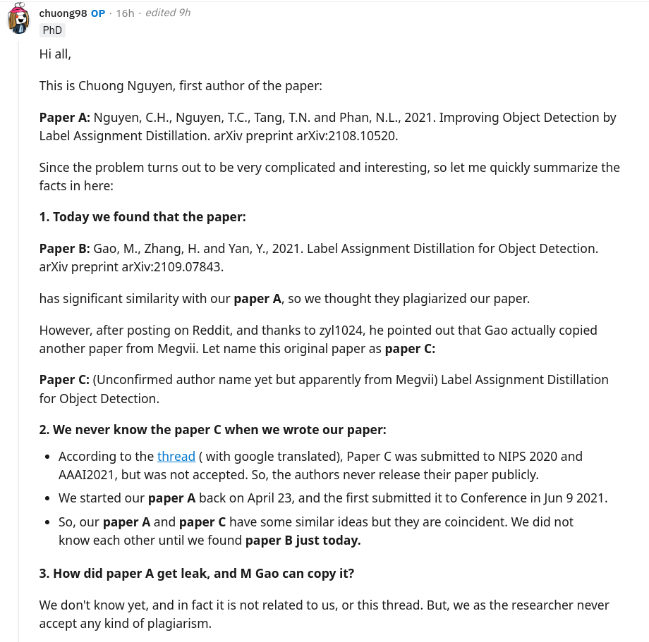
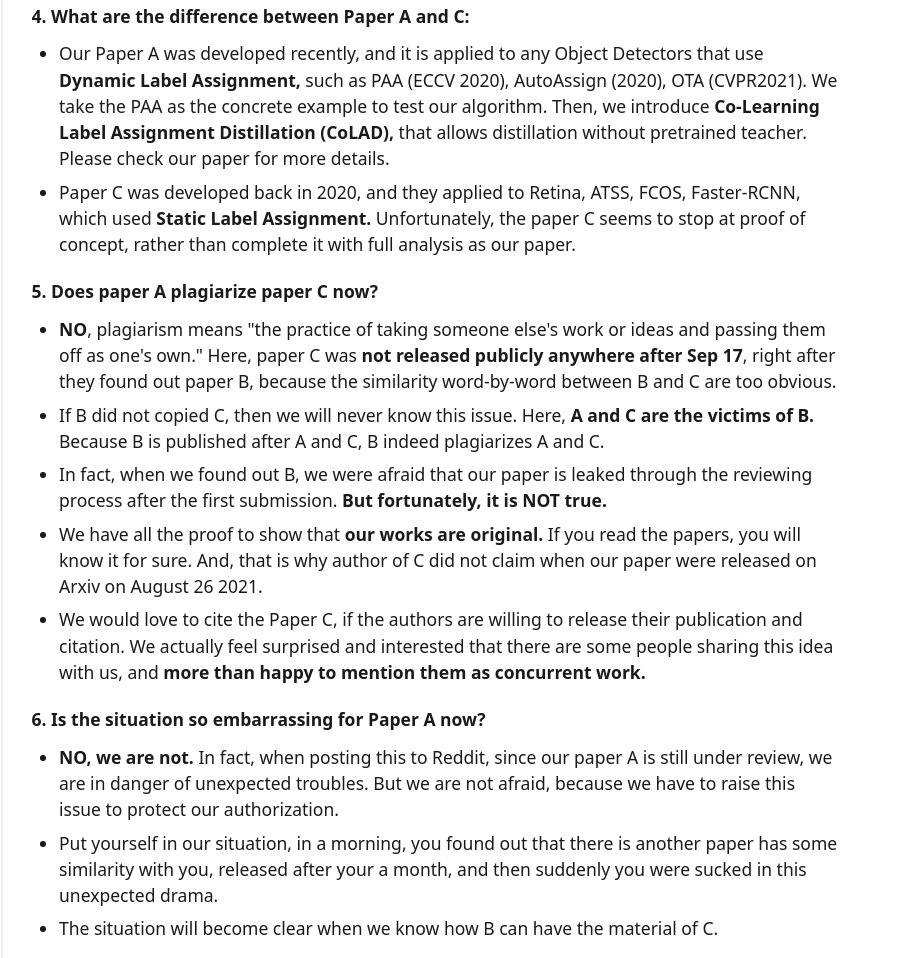
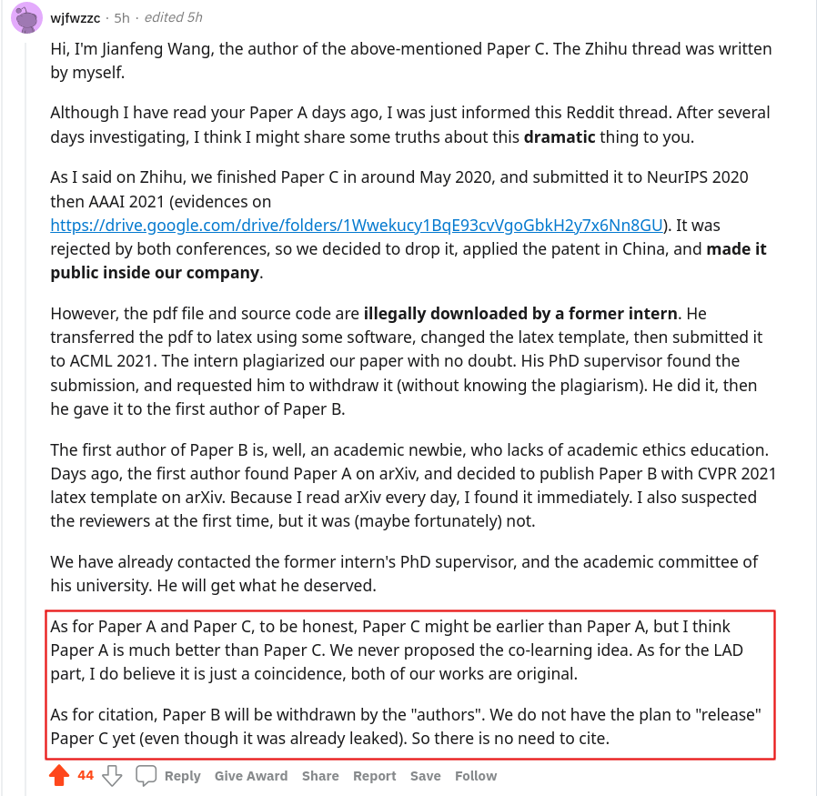

# Concurrent Work Issue

Summary of the Reddit post at:

https://www.reddit.com/r/MachineLearning/comments/pvgpfl/ndr_alleged_plagiarism_of_improve_object/?utm_source=share&utm_medium=web2x&context=3

### 1. Problem Summary (Screen Shot From Reddit)

  
   

### 2. Author of Paper C response (Screen Shot From Reddit):

### 3. Confirmed Email from Authors of paper C:
Please see the [confirmed emails](ConfirmLetter.pdf)

